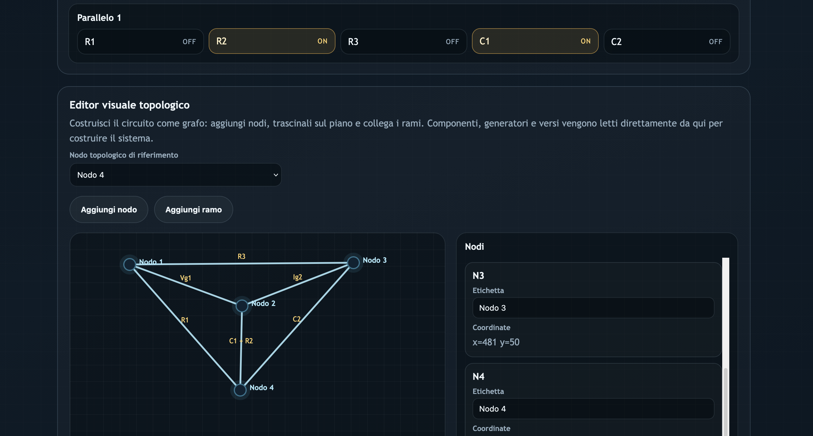
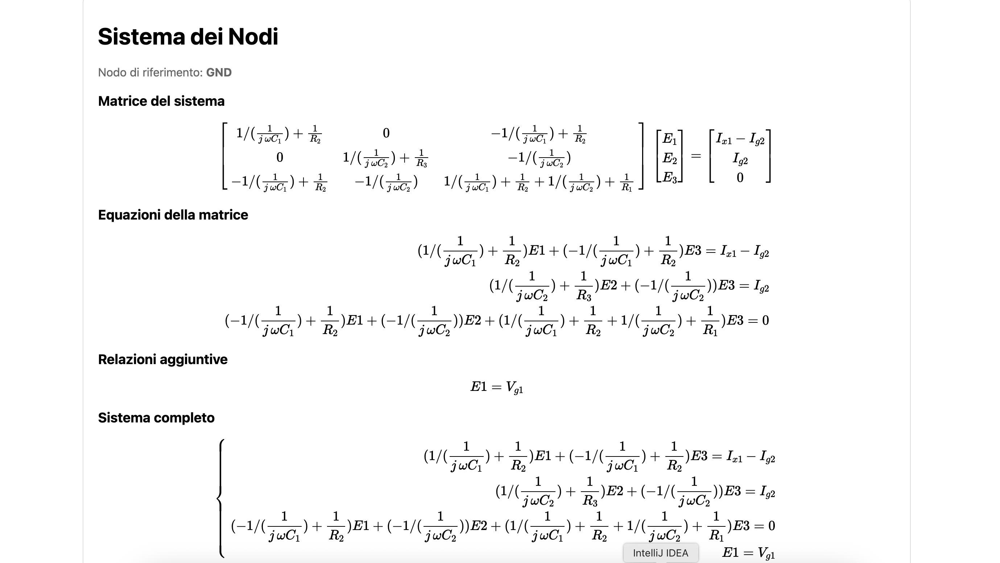
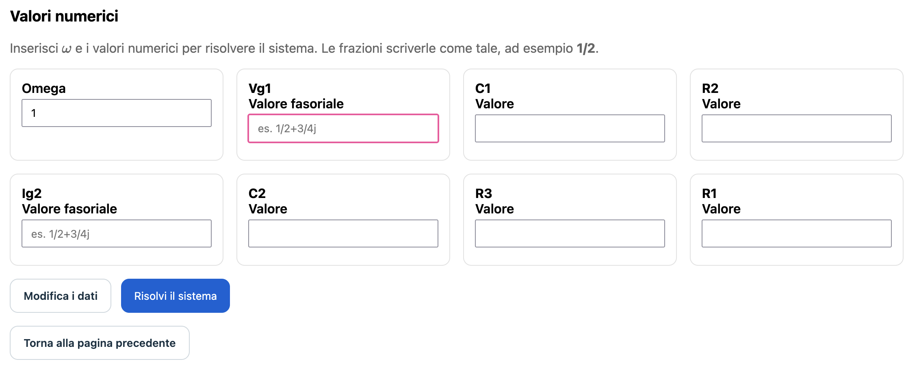

# Noduloom


A visual circuit analysis studio for building, formalizing, and solving electrical systems with nodal and mesh methods.

Noduloom turns circuit analysis into a guided workflow: define the method, model the topology, generate the symbolic system, and solve it numerically.

---

## Overview

Noduloom is a Java web application designed for circuit analysis in the phasor domain.  
It supports both **nodal analysis** and **mesh analysis**, with a strong focus on clarity, topology-driven modeling, and readable mathematical output.

Instead of jumping directly to formulas, the application helps the user describe the circuit structure first.  
That topological description is then converted into the corresponding system of equations and, finally, into a numerical solution.

This makes Noduloom especially suitable for:

- electrical engineering coursework
- guided demonstrations and presentations
- methodical circuit formalization
- educational use where sign conventions and branch orientation matter

## Core Features

- Support for **nodal method** and **mesh method**
- Interactive **topology editor** with nodes and branches
- Explicit handling of:
  - resistors `R`
  - inductors `L`
  - capacitors `C`
  - current sources `Ig`
  - voltage sources `Vg`
- Branch-based component assignment through guided selection
- Support for passive component grouping in **series** and **parallel**
- Reference node selection for nodal analysis
- Symbolic generation of:
  - matrix form
  - expanded equations
  - additional constraints
  - full final system
- Numerical solving with real and phasor values

## Workflow

### 1. Configure the analysis

The user starts by selecting the analysis method and defining:

- the number of unknowns
- the available circuit components
- the mesh current directions, when mesh analysis is used
- the reference node, when nodal analysis is used

### 2. Build the circuit topology

The circuit is modeled visually as a graph.

The user can:

- add nodes
- add branches
- assign components to each branch with checkboxes
- define branch orientation and source polarity
- select the node eliminated as reference in nodal analysis
- clear the topology or clear series/parallel groups independently

### 3. Generate the symbolic system

Once the topology is complete, Noduloom builds the corresponding symbolic system and displays:

- the matrix representation
- the expanded equations
- the additional relations required by the circuit
- the full system in readable form

### 4. Solve numerically

In the final step, the user enters component values and source phasors, together with angular frequency when required.  
The application then computes and displays the numerical system and its solution.

## Why Noduloom

Many mistakes in circuit analysis do not come from the final algebraic step.  
They come earlier:

- wrong current directions
- inconsistent sign conventions
- incorrect handling of shared branches
- poor interpretation of generators
- loss of structure between circuit drawing and equation system

Noduloom addresses exactly that stage.  
Its purpose is not only to solve circuits, but to make the construction of the system **explicit, inspectable, and teachable**.

## Technology Stack

- Java
- Java Servlet API
- JSP
- Maven
- Tomcat-compatible deployment
- MathJax for formula rendering

## Project Structure

```text
src/main/java/com/example/servlet/   Core servlets, symbolic generation, topology logic, solver
src/main/webapp/                     JSP views and web resources
docs/images/                         Project visuals, screenshots, and branding assets
pom.xml                              Maven build configuration
```

## Screenshots

### Initial Configuration

The entry screen defines the analysis method, the number of unknowns, and the available inventory of components.


### Topology Editor

The circuit is built as a graph, where nodes, branches, component assignment, and source orientation are explicitly defined.



### Symbolic System

After the topology is formalized, Noduloom generates the symbolic matrix and the related circuit equations.



### Numerical Solving

The final step allows the user to provide numerical values and obtain the full solved system.



## Vision

Noduloom is built around a simple idea:

> circuit analysis should be understandable before it becomes numerical.

The application bridges the gap between the visual structure of a circuit and the formal structure of its equations, making the reasoning process easier to present, debug, and teach.

## Author

**Simone Remoli**

Developed as a circuit-analysis application with a presentation style aligned with engineering education and structured problem solving.
